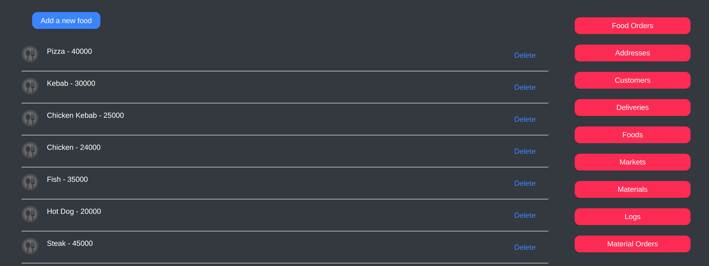
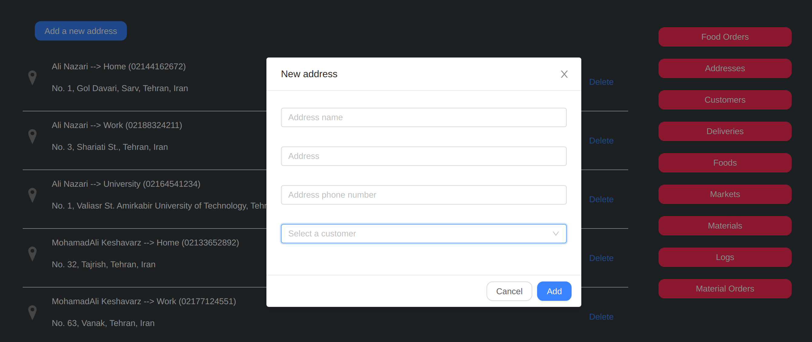

# Sitadu - Restaurant Manager

Sitadu is a simple desktop web application as a restaurant manager implemented with a mysql database, NodeJS backend and ReactJS frontend.



I have done this project to learn mysql better. 
<br/>I had a few frontend skills and no backend skills at that time :D



### Installation

#### mysql
```
sudo apt update
sudo apt install mysql-server
sudo mysql_secure_installation
```

#### Create database
```
sudo mysql
CREATE DATABASE restaurant_manager;
sudo mysql restaurant_manager < restaurant_manager.sql
```

#### NodeJS
```
cd backend
npm install
```

#### ReactJS
```
cd frontend
npm install
```

### Run 

#### backend
```
cd backend
npm start
```
#### frontend
```
cd frontend
npm run dev
```
